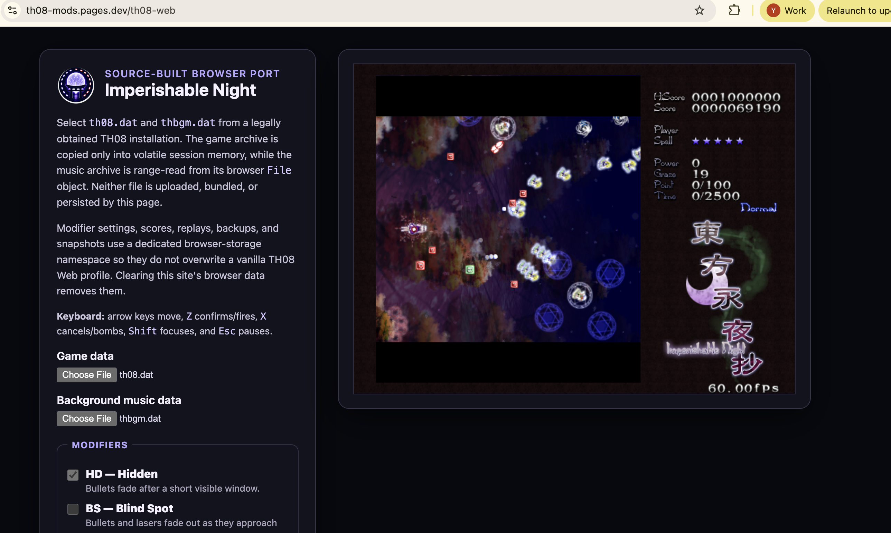

<p align="center">
  
</p>

<h1 align="center">TH08 Mods</h1>

<p align="center">
  <strong>The moon is fake. The bullets are shy. The playfield is sideways.</strong>
</p>

<p align="center">
  Eleven ways to make Imperishable Night a completely different incident.<br>
  Play in a browser, run natively on Linux, or carry the spellbook to another Touhou game.
</p>

<p align="center">
  <a href="https://th08-mods.pages.dev/"><strong>Enter the modified night</strong></a>
  ·
  <a href="#choose-tonights-incident">Meet the mods</a>
  ·
  <a href="docs/MOD_PLAN.md">Open the spellbook</a>
  ·
  <a href="docs/WEB_PORTING.md">Read the incident report</a>
</p>

<p align="center">
  <a href="https://github.com/N0zoM1z0/th08-mods/actions/workflows/deploy-web.yml"></a>
  <a href="https://github.com/N0zoM1z0/th08-mods/actions/workflows/ci.yml"></a>
  <a href="LICENSE"></a>
</p>

It is after midnight. The incident has been investigated, the culprit has been
found, and unfortunately someone left an **Enable Mods** panel next to the
entrance.

**TH08 Mods** is the real reconstructed C++ game running with a portable
modifier runtime—not a remake, an emulator, or a collection of memory patches.
The same rules run as WebAssembly in your browser and as native code on Linux.
Every mod has its own little room in the source tree, so they can combine
without becoming one enormous cursed patch.

> [!IMPORTANT]
> Bring your own legally obtained `th08.dat` and `thbgm.dat`. This repository
> and the public site do not contain the game executable, DAT archives, or
> extracted retail assets. The browser never uploads your selected files.

## Incident footage: seven modifiers, one very confused moon

Seven modifiers. A vertical mirror. No bombs. No game over. Darkness hides the
danmaku, the blind spot hides what remains, and up and down have quietly stopped
meaning what they did five minutes ago. This is exactly why the launcher has
checkboxes.

<p align="center">
  <a href="https://youtu.be/hKfWujQaGBc" title="Watch the TH08 Mods gameplay recording on YouTube">
    
  </a>
</p>

<p align="center">
  <a href="https://youtu.be/hKfWujQaGBc"></a><br>
  <code>HD + FL + MR (Vertical) + NF + EZ + BS + NB</code>
</p>

## Enter before dawn

1. Visit **[th08-mods.pages.dev](https://th08-mods.pages.dev/)** in a current
   desktop browser. Chrome is recommended; Firefox gets its own presentation
   build automatically.
2. Choose `th08.dat` and `thbgm.dat` from your TH08 installation.
3. Select an incident—or several—and press **Start TH08**.

No installer. No account. No server-side game session. Just two local files,
eleven suspicious checkboxes, and whatever happens next.

## Choose tonight's incident

| Code | Incident | What went wrong |
| :---: | --- | --- |
| `HD` | **Hidden** | New bullets introduce themselves, linger briefly, then fade out. History class starts now. |
| `FL` | **Flashlight** | Someone turned off the stage lights. A feathered lantern around the player is all you get. |
| `AT` | **Autoshot** | A tiny familiar has been assigned to hold Shoot. Movement, focus, and bombs are still your problem. |
| `MR` | **Mirror** | The boundary between up, down, left, and right has become negotiable. Flip horizontally or vertically, or rotate by 90°, 180°, or 270°. The HUD stays upright; your instincts do not. |
| `NF` | **No Fail** | Misses, death animations, power loss, and respawns still happen. The run simply refuses to accept that zero lives means “stop.” |
| `DT` | **Double Time** | Active gameplay advances at a deterministic 1.5× speed. Menus and pause remain at 1× so you have time to reconsider. |
| `HR` | **Hard Rock** | Bullets gain 15% speed, you lose 10% movement speed, your hitbox grows 25%, and the graze radius shrinks 20%. Reisen calls this “calibration.” |
| `EZ` | **Easy** | Bullets slow by 15%, your hitbox shrinks 25%, grazing widens 25%, spells last 25% longer, and you begin with two extra bombs. Eirin has prescribed basic kindness. |
| `RX` | **Relax** | Shoot and Focus are held automatically. You only move and decide when the situation deserves a bomb. |
| `BS` | **Blind Spot** | Bullets and lasers fade as they approach, becoming completely invisible within 48 pixels. The danger is closest when you can no longer see it. |
| `NB` | **No Bomb** | Bomb input disappears during gameplay. That reassuring `X` key is decorative now. |

There are only two paradoxes the runtime refuses to permit:

- `HR` + `EZ` — Eirin cannot make the same prescription cruel and merciful.
- `AT` + `RX` — two familiars cannot both own the Shoot key.

Everything else stacks. This is not necessarily an endorsement.

## Recommended bad decisions

| Name | Recipe | Expected outcome |
| --- | --- | --- |
| **Boundary of Common Sense** | `MR` at 90° + `DT` | The entire incident is sideways and late for an appointment. |
| **History That Was Never Written** | `HD` + `BS` | Bullets vanish because they are old, then vanish again because they are close. Remember everything. |
| **Hourai Elixir Driving Lesson** | `RX` + `NB` + `NF` | Shooting is automatic, bombing is forbidden, and the night cannot kill your run. Steer responsibly. |
| **Eirin's Prescription** | `EZ` + `NF` | A gentle way to tour patterns, stages, dialogue, and endings without the usual appointment with Continue. |
| **The Moon Chose Violence** | `HD` + `FL` + `DT` + `HR` | Less light, less information, less time, and faster bullets. A flawless plan. |

The Web build requires WebAssembly threads, `SharedArrayBuffer`, WebGL 2, Web
Audio, and a cross-origin-isolated HTTPS page. The production site supplies the
required COOP and COEP headers. The launcher checks isolation, shared memory,
canvas transfer, and WebGL 2 before enabling Start and reports a missing
requirement directly.

For the smoothest bullet-hell input and pacing, close heavily loaded tabs,
leave browser hardware acceleration enabled, and avoid power-saving modes that
throttle the display refresh rate.

## The traditional controls still work

| Key | Action |
| :---: | --- |
| Arrow keys | Move / navigate menus |
| `Z` | Shoot / confirm |
| `X` | Bomb / cancel |
| `Shift` | Focus movement and show the hitbox |
| `Esc` | Pause and reflect on your decisions |

The browser launcher freezes a canonical run manifest before the game begins,
so the exact rules and Mirror direction belong to that run. Replays and saves
live in a dedicated `th08-mods` browser-storage namespace; they cannot overwrite
a vanilla TH08 Web profile.

## A portable spellbook

The fun part is not only that these mods exist. It is that they are written to
travel.

```text
src/mod/modifiers/
├── hidden/
│   ├── HiddenPolicy.*       ← portable rule
│   └── th08/Th08Hidden.*    ← TH08 translation
├── mirror/
│   ├── MirrorPolicy.*
│   └── th08/Th08Mirror.*
└── ... one room for every incident
```

The portable policy owns the rule: timing, geometry, input filtering,
conflicts, and deterministic state. The tiny `th08/` adapter teaches that rule
how to observe TH08 bullets, players, rendering, and input. Web and Linux merely
choose a configuration and host the game.

That means a future TH06 or TH07 port can keep the spell and replace the
translator. No copy-pasted browser patches. No giant `mods.cpp`. Just another
game adapter opening the same book. The complete design lives in
[`docs/MOD_PLAN.md`](docs/MOD_PLAN.md).

<details>
<summary><strong>For incident investigators who immediately opened a terminal</strong></summary>

### Native Linux

Build the 32-bit target and point it at your legal retail files:

```bash
scripts/build-modern-linux.sh
build/modern-linux/th08-modern \
  --data-dir /path/to/legal/th08/files \
  --mods=HD,FL,MR,DT,BS,NB \
  --mirror=90
```

Ask the runtime what it understood without starting the game:

```bash
build/modern-linux/th08-modern --mods=RX,NB,NF --mod-manifest
build/modern-linux/th08-modern --mod-help
```

Long names such as `hidden`, `double-time`, `blind-spot`, and `no-bomb` work
too. Mirror accepts `horizontal`, `vertical`, `90`, `180`, and `270`.

### WebAssembly

Requirements: Docker, Python 3, and a desktop browser.

```bash
scripts/build-web-game.sh
python3 scripts/check-web-provenance.py --artifact build/web-dist
scripts/serve-web.py --port 8000
```

The build is intentionally single-job and limits each Docker invocation to two
CPUs and 4 GiB by default. Override the caps only when needed, for example:

```bash
TH08_WEB_BUILD_CPUS=1 TH08_WEB_BUILD_MEMORY=3g scripts/build-web-game.sh
```

Open `http://127.0.0.1:8000/`. Do not use a generic static server for this
build: Emscripten pthreads require the COOP, COEP, and CORP headers supplied by
`scripts/serve-web.py`.

The deployment gate permits exactly these nine static files:

```text
_headers
_redirects
th08-web.html
th08-web.js
th08-web.wasm
th08-web-firefox.html
th08-web-firefox.js
th08-web-firefox.wasm
th08-web-icon.png
```

An extra file, missing file, symlink, executable, retail archive, or common
archive container fails the build. Chrome uses a worker-owned canvas; Firefox
uses a dedicated main-thread WebGL presentation path. Both execute the same
authored game and modifier core.

After packaging or testing, the generated trees can be reclaimed explicitly:

```bash
cmake -E remove_directory build/web-game
cmake -E remove_directory build/web-dist
cmake -E remove_directory build/emscripten-cache
```

### Deployment

Pushes to `main` validate the repository, build both browser variants, verify
the exact artifact boundary, and deploy to Cloudflare Pages through
[`deploy-web.yml`](.github/workflows/deploy-web.yml). Tagged releases package
the same nine files plus a SHA-256 manifest.

The deep technical route is documented in
[`docs/WEB_ARCHITECTURE.md`](docs/WEB_ARCHITECTURE.md). The longer story of
getting a Direct3D 8-shaped, DirectSound-shaped, Win32 game across the browser
boundary is in [`docs/WEB_PORTING.md`](docs/WEB_PORTING.md).

</details>

## The two grimoires underneath this one

TH08 Mods stands on two maintained source foundations:

- [N0zoM1z0/th08](https://github.com/N0zoM1z0/th08) — reconstructed TH08 game
  source and the native build foundation.
- [N0zoM1z0/th08-web](https://github.com/N0zoM1z0/th08-web) — WebAssembly,
  browser compatibility, local persistence, and deployment foundation.

Touhou Project and `東方永夜抄 ～ Imperishable Night` are works of Team Shanghai
Alice / ZUN. TH08 Mods is an unofficial fan project and is not affiliated with
or endorsed by Team Shanghai Alice.

Repository code and documentation are available under the included
[MIT License](LICENSE). That license does not grant rights to the original
game, executable, DAT files, music, dialogue, graphics, or other retail
content.

<p align="center">
  <strong>The night is imperishable. Your control scheme is not.</strong>
</p>
