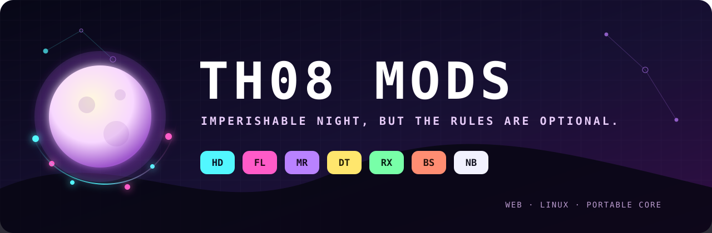

<p align="center">
  
</p>

<h1 align="center">TH08 Mods</h1>

<p align="center">
  <strong>Imperishable Night, but the rules are optional.</strong>
</p>

<p align="center">
  Eleven deterministic gameplay modifiers. One portable runtime. Web first,
  Linux ready, and designed to travel to TH06 and TH07.
</p>

<p align="center">
  <a href="https://th08-mods.pages.dev/"><strong>Play TH08 Mods</strong></a>
  ·
  <a href="docs/MOD_PLAN.md">Modifier roadmap</a>
  ·
  <a href="docs/WEB_ARCHITECTURE.md">Web architecture</a>
  ·
  <a href="docs/WEB_PORTING.md">Porting story</a>
</p>

<p align="center">
  <a href="https://github.com/N0zoM1z0/th08-mods/actions/workflows/deploy-web.yml"></a>
  <a href="https://github.com/N0zoM1z0/th08-mods/actions/workflows/ci.yml"></a>
  <a href="LICENSE"></a>
</p>

The false moon has been up for long enough. It is time to rotate it 90 degrees,
hide half the bullets, accelerate the clock, disable bombs, and see what
happens.

**TH08 Mods** turns the source-reconstructed Touhou Eiyashou ~ Imperishable
Night into a composable modifier playground. The original C++ game logic runs
natively on Linux or as WebAssembly in the browser. Mods live in small,
independent source modules instead of a monolithic patch, so rules can be mixed,
tested, replayed, and ported without tying them to one frontend.

> [!IMPORTANT]
> This project does not distribute `th08.dat`, `thbgm.dat`, `th08.exe`, or
> extracted retail assets. You must provide the two DAT files from your own
> legally obtained copy of TH08. In the Web build they stay on your machine and
> are never uploaded to the site.

## Play now

1. Open **[th08-mods.pages.dev](https://th08-mods.pages.dev/)** in a current
   desktop browser. Chrome is recommended; Firefox has a dedicated build.
2. Select `th08.dat` and `thbgm.dat` from your legal TH08 installation.
3. Pick some modifiers, choose **Start TH08**, and click the canvas if it needs
   keyboard focus.

The launcher keeps `th08.dat` in volatile session memory and range-reads
`thbgm.dat` directly from the selected browser file. Settings, scores, replays,
backups, and snapshots use a dedicated IndexedDB namespace that is separate
from the original TH08 Web deployment.

## Pick your poison

| Code | Modifier | What it does |
| --- | --- | --- |
| `HD` | Hidden | Bullets and lasers fade away as they age. Remember the pattern or improvise. |
| `FL` | Flashlight | Darkness covers the playfield except for a feathered window around the player. |
| `AT` | Autoshot | Holds Shoot during active gameplay while leaving movement, focus, and bombs to you. |
| `MR` | Mirror | Reflects horizontally or vertically, or rotates the playfield by 90°, 180°, or 270°. Input follows the transformed view and the HUD stays upright. |
| `NF` | No Fail | Preserves misses, deaths, power loss, and respawns, but lets the run continue at zero lives. |
| `DT` | Double Time | Advances active gameplay at a deterministic 1.5× rate while menus and pause remain at 1×. |
| `HR` | Hard Rock | 15% faster bullets, 10% slower movement, a 25% larger hitbox, and a 20% tighter graze radius. |
| `EZ` | Easy | 15% slower bullets, a 25% smaller hitbox, a 25% wider graze radius, two extra starting bombs, and 25% longer spell timers. |
| `RX` | Relax | Holds Shoot and Focus during gameplay; movement and bombs remain manual. |
| `BS` | Blind Spot | Projectiles fade as they approach and become invisible within 48 pixels of the player. |
| `NB` | No Bomb | Removes bomb input during gameplay. There is no emergency button now. |

`HR` conflicts with `EZ`, and `AT` conflicts with `RX`. All other combinations
are fair game.

### Suggested bad ideas

| Recipe | Mods | Experience |
| --- | --- | --- |
| Memory Palace | `HD,BS` | Bullets disappear with age and proximity. Your working memory is the renderer. |
| Sideways Moon | `MR,DT` + rotate 90° | Turn the playfield on its side, then give it a deadline. |
| Just Dodge | `RX,NB,NF` | Shooting is automatic, bombing is impossible, and the run refuses to end. |
| The Moon Chose Violence | `HD,FL,DT,HR` | Less information, less time, faster bullets, larger consequences. |

## Controls

| Key | Action |
| --- | --- |
| Arrow keys | Move / navigate menus |
| `Z` | Shoot / confirm |
| `X` | Bomb / cancel |
| `Shift` | Focus movement and show the hitbox |
| `Esc` | Pause |

## Run it on Linux

Build the 32-bit native target, then point it at your legal retail files:

```bash
scripts/build-modern-linux.sh
build/modern-linux/th08-modern \
  --data-dir /path/to/legal/th08/files \
  --mods=HD,FL,MR,DT,BS,NB \
  --mirror=90
```

Inspect a normalized selection without starting the game or supplying DAT
files:

```bash
build/modern-linux/th08-modern --mods=RX,NB,NF --mod-manifest
build/modern-linux/th08-modern --mod-help
```

Long names such as `hidden`, `double-time`, `blind-spot`, and `no-bomb` are
accepted too. Mirror defaults to horizontal and supports `horizontal`,
`vertical`, `90`, `180`, and `270`.

## How the mods travel

Every modifier is a vertical slice under `src/mod/modifiers/`:

```text
src/mod/modifiers/
├── hidden/
│   ├── HiddenPolicy.*       # portable rule
│   └── th08/Th08Hidden.*    # TH08 observation and rendering adapter
├── mirror/
│   ├── MirrorPolicy.*
│   └── th08/Th08Mirror.*
└── ... one directory per modifier
```

The portable layer owns configuration, conflicts, input policy, geometry,
timing, and deterministic manifest generation. The `th08/` layer translates
those policies into the reconstructed game's concrete objects and hooks. Web
and Linux are hosts: they select a configuration through the shared C ABI, but
do not own gameplay rules.

That boundary is deliberate. A future TH06 or TH07 port keeps the portable
policy and supplies a new game adapter instead of copying frontend-specific
patches. The full compatibility, replay, and adapter contract lives in
[`docs/MOD_PLAN.md`](docs/MOD_PLAN.md).

## Build the Web version

Requirements:

- Docker
- Python 3
- a desktop browser
- your own legal `th08.dat` and `thbgm.dat`

Build the pinned Release configuration, verify the exact public artifact, and
start the development server:

```bash
scripts/build-web-game.sh
python3 scripts/check-web-provenance.py --artifact build/web-dist
scripts/serve-web.py --port 8000
```

Open `http://127.0.0.1:8000/`. The repository server supplies the COOP, COEP,
and CORP headers required by Emscripten pthreads.

The generated deployment directory contains exactly nine allowlisted files:

```text
_headers
_redirects
th08-web.html
th08-web.js
th08-web.wasm
th08-web-firefox.html
th08-web-firefox.js
th08-web-firefox.wasm
th08-web-icon.png
```

An extra file, missing file, symbolic link, executable, retail archive, or
common archive container fails the provenance gate.

## Web architecture

- The reconstructed C++ game and PBG archive code compile to WebAssembly with
  a digest-pinned Emscripten toolchain.
- `PROXY_TO_PTHREAD` keeps the authored game loop away from the browser UI
  thread while retaining the startup and BGM thread structure.
- A direct WebGL 2 renderer translates the D3D8-shaped draw interface into
  shaders, batched vertex uploads, and canvas presentation.
- The DirectSound-shaped mixer feeds Web Audio while BGM data is range-read
  from the local file.
- Browser key events enter shared atomic state and merge with the
  DirectInput-shaped polling path.
- IDBFS persists only allowlisted save paths. Retail archives remain outside
  persistent storage.

Chrome and Chromium use a worker-owned canvas. Firefox automatically selects a
main-thread WebGL presentation build that avoids expensive per-frame canvas
readback. See [`docs/WEB_ARCHITECTURE.md`](docs/WEB_ARCHITECTURE.md) for the
verified boundaries and [`docs/WEB_PORTING.md`](docs/WEB_PORTING.md) for the
engineering narrative.

## Deployments and releases

Cloudflare Pages hosts the static build at
**[th08-mods.pages.dev](https://th08-mods.pages.dev/)** because the game needs
repository-defined cross-origin isolation headers. Pushes to `main` validate,
build, provenance-check, and deploy through
[`deploy-web.yml`](.github/workflows/deploy-web.yml).

The workflow expects these GitHub repository secrets:

- `CLOUDFLARE_ACCOUNT_ID`
- `CLOUDFLARE_API_TOKEN`, scoped to **Account → Cloudflare Pages → Edit**

Pull requests do not deploy and do not receive those secrets. Never place
deployment credentials in the repository or command logs.

Tagged releases package the same nine static files plus a SHA-256 manifest:

```bash
scripts/build-web-game.sh
scripts/package-web-release.sh v0.1.0
```

Release archives still contain no retail data and require a host that applies
the included isolation headers.

## Repository map

| Path | Purpose |
| --- | --- |
| `src/mod/modifiers/` | Independent portable modifier policies and TH08 adapters |
| `src/mod/core/` | Runtime state, validation, ordering, and deterministic queries |
| `src/mod/hosts/` | Reusable host-side configuration adapters |
| `src/modern/web/` | Browser launcher and Web compatibility boundary |
| `src/modern/linux/` | Native Linux compatibility and presentation boundary |
| `tests/mod/` | Portable modifier, registry, runtime, and CLI tests |
| `scripts/check-web-provenance.py` | Exact artifact and retail-data deployment gate |
| `docs/MOD_PLAN.md` | Modifier architecture, status, and porting contract |

## Foundations

This repository combines two maintained source foundations:

- [N0zoM1z0/th08](https://github.com/N0zoM1z0/th08) — the reconstructed TH08
  game source and native build foundation.
- [N0zoM1z0/th08-web](https://github.com/N0zoM1z0/th08-web) — the WebAssembly,
  browser compatibility, persistence, and deployment foundation.

Touhou Project and `東方永夜抄 ～ Imperishable Night` are works of Team Shanghai
Alice / ZUN. TH08 Mods is an unofficial fan project and is not affiliated with
or endorsed by Team Shanghai Alice.

## License

Repository code and documentation are provided under the included
[MIT License](LICENSE). That license does not grant rights to the original
game, executable, DAT files, music, dialogue, graphics, or other retail
content.
